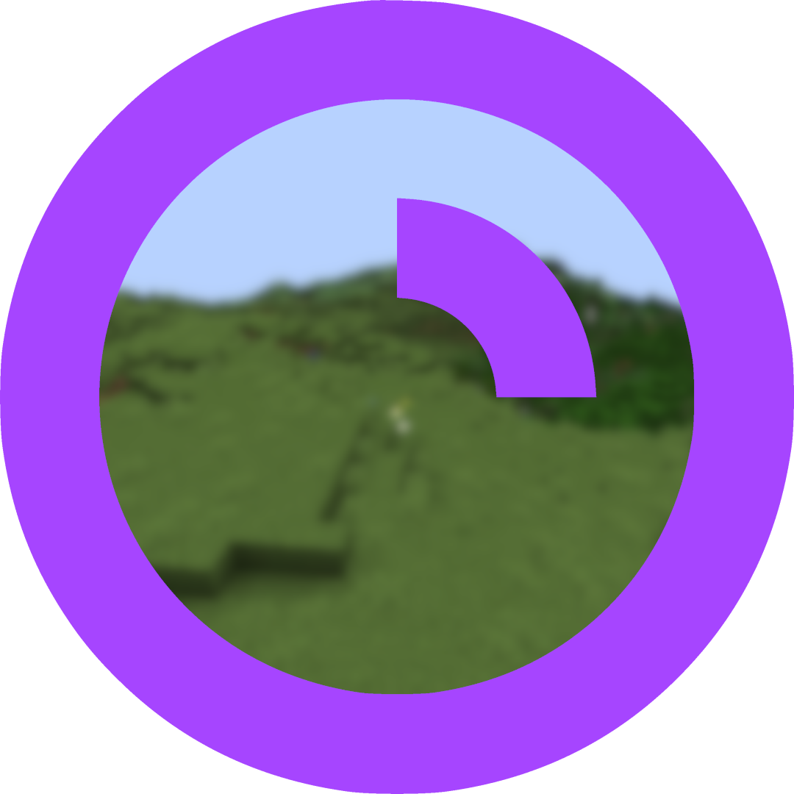

 <h1>ChatPointsTTV</h1>

ChatPointsTTV is a Spigot plugin that helps you to create interactions between your Twitch chat and your Minecraft world. You can set up custom channel points rewards on your channel that can spawn mobs and execute commands, giving you a huge variety of possibilities for rewards.

You will need to setup a Twitch Application in the Dev Console.

### **Setup**
1. Install the plugin into your Minecraft server.
2. Create an app using [Twitch Developer Console](https://dev.twitch.tv/console). (Refer to ["Setting up a Twitch app"](#setting-up-a-twitch-app)).
3. Copy your Client ID and your secret token to your [config.yml](/src/main/resources/config.yml).*
4. Open your [Twitch Dashboard](https://dashboard.twitch.tv) and create your custom Channel Points Rewards.
> [!TIP]
>  If needed, you can copy-paste the names of the Channel Points Rewards into a text document for later use.
  
5. Add to your [config.yml](/src/main/resources/config.yml) your newly created Twitch rewards, and setup the actions.
> [!NOTE]
> Copy the name **EXACTLY** as it is on Twitch.
  
6. Customize the text and it's formatting (optional).

*: The config file for the plugin should be in 'plugins/ChatPointsTTV/config.yml'.

### **Setting up a Twitch app**
1. Go to [Twitch's Developer Console](https://dev.twitch.tv/console) and login.
2. Click "Register your application".
3. Fill in a name, and for the OAuth redirect, type 'https://localhost'. Choose a category and generate a secret. (copy your app ID and your secret into config.yml).

### **Credits**
Thanks to [Twitch4J](https://twitch4j.github.io/) for the Java libraries used in this mod to communicate with the Twitch API.
